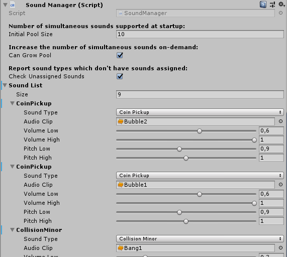

# SoundManager component for Unity3D

My take on a light-weight sound manager in Unity3D. Admittedly I haven't looked into any implementations on the Asset Store, etc., because I didn't want to spoil the fun of writing mine from scratch. So this is just a small, single-class component with a nested helper class; with solid core features that should perform reliably and efficiently.

I've been using it in my project for quite some time, and I'm a satisfied customer, so to speak, so I decided to share it.

Pro tip: It's totally not spaghetti code, like many things you can find in relation to Unity. ;) It's not perfect either, though, but I didn't want to fragment it too much, since the added method call overhead, however minor, is not that useful in games.

*(Never mind that when I started to 'polish it up' for sharing it was merely 165 lines long... It's still small with around 400 lines, but not as tiny and cute anymore.)*

## Quick overview of Inspector pane:

## Rationale

Pretty much everybody uses some sort of audio or sound manager, from what I'm aware of. But if you're not sure what's the point:

- ### Playing sounds on destroyed/disabled objects
  - If you have an AudioSource on a GameObject, and you destroy it (or ideally, disable for releasing into the pool), you can't play any sounds on it, since sound playback stops instantly.
- ### Playing sounds with modulated pitch/volume
  - Sounds sound the best if you slightly modulate the pitch and volume each time you play them, to make them feel natural. It's messy to do this individually everywhere.

## Features

- ### Customizable random pitch and volume range for each AudioClip
  - You can set up the range of random pitch and volume for each audioclip at a centralized location. Then you just simply play the sound by invoking `PlaySound()`, and the pitch and volume will be automatically modulated each time.
  
- ### Defining multiple `AudioClip`s for a sound type
  - One given sound type can have multiple entries and `AudioClip`s associated to it in the list. The `SoundManager` automatically creates a list internally from all 'sound variations' of a given sound type, and when you invoke `PlaySound()`, it selects one randomly. This is also a rather important part of providing rich and diverse audio experiences.
  
- ### Smart, automatic pooling of AudioSources
  - You can define how many simultaneous sounds you want to support at startup. The `SoundManager` automatically reserves them from the pool to play the requested sound, waits for the playback to stop, and then puts the `AudioSource` back to the pool. No polling involved whatsoever. Coroutine-based operation. No wasteful use of collections, it uses a simple `Stack` the way it's supposed to be used.  
 
- ### Support for 3D positioned AudioSources
  - My current game is 2D, so I have no use for this, but I wanted to add this little extra before sharing it. Basically, you can simply use an overloaded version of the `PlaySound()` method that accepts a `Vector3` position defining where to play the sound. So, for example:
 
    `SoundManager.Instance.PlaySound(GameSound.Death, transform.position)`
 
   - When the playback is complete, the `AudioSource` will be instantly put back to its original place. There is no expensive reparenting involved; the `SoundManager` simply creates a `GameObject` for each pooled `AudioSource`, so it can position them anywhere.
  
- ### Overriding preset pitch and volume
  - There is an overloaded version of the `PlaySound()` method accepting two floats which serve as multipliers to pitch and volume. So if you find yourself wanting to play a faster/slower or louder/quieter sound than normal, or play it reverse by using a negative pitch, you can.
  
- ### Callback when playback is finished
  - All overloads of the `PlaySound()` method accept an optional `callback` parameter, in case you want to be notified when the playback finishes.
  - Additionally, all methods return the `AudioSource` playing your requested sound, so you can monitor it yourself if you want. But don't mess with the playback settings on the returned `AudioSource`, because then the `SoundManager` won't be able to predict the end time of the playback (to release the `AudioSource` to the pool). (It does have built-in safety mechanism for additional waiting, though.)
  
- ### Thoroughly commented and documented code
  - I added standard XML documentation tags to all public methods, so Visual Studio's IntelliSense can help you understand what do methods and parameters do.
  - Also, the code contains lots of comments, including on all private methods and everywhere where something might not be obvious. I think I went a bit overboard, because I know that many Unity3D users are not that well-versed in programming.

- ### Generally robust and error-tolerant design
  - There are a lot of checks internally for various error cases, and they log intelligible warning messages to the console. Of course you might want to strip out this debug logging, integrate some switchable or injected logging system, or whatever.
  
- ### Generally efficient code
  - I tried to avoid allocations and losing performance for no good reason. So it uses `bool` flags instead of more expensive checking, properly uses a `Dictionary` for lookups and `Lists` for indexed access, and even caches `Vector3.zero` to avoid those repetitive calls.
  - One thing you might want to look into is the infamous allocation when you use `enum` as `Dictionary` keys. I have no idea if this still happens in the version of Mono current Unity3D releases use; if so, you can supposedly avoid it by providing a custom comparer.

## Usage examples

Just for illustrative purposes, because it's really obvious and straightforward to use.

  - Playing a 'sound type' **the simplest way possible** (no 3D positioning, perfect for mobile games):

     `SoundManager.Instance.PlaySound(GameSound.Rocket);`

  - Playing a 'sound type' **at a given world position**:

     `SoundManager.Instance.PlaySound(GameSound.Rocket, transform.position);`
     
  - Playing a 'sound type' **at a given world position**, by **overriding pitch and volume** with a multiplier on top (obviously you can leave out the parameter names :) ):

     `SoundManager.Instance.PlaySound(GameSound.Rocket, transform.position, volumeMultiplier: 0.5f, pitchMultiplier: 0.6f);`
     
  - Playing a 'sound type' **at a given world position**, by **overriding pitch and volume** with a multiplier on top, and setting a **callback to be invoked when the sound playback finishes** (where *DoAfterPlayback* is a void parameterless method):

     `SoundManager.Instance.PlaySound(GameSound.Rocket, transform.position, volumeMultiplier: 0.5f, pitchMultiplier: 0.6f, DoAfterPlayback);`
     
*(Note that the callback shown is obviously available as an optional parameter on all of the method overloads, not just on the longest. Also note that there is an overload for setting pitch and volume override without having to specify a `Vector3`.)*

## Setup

1. **Specify your `sound types` by editing the `GameSound` enum.** This means that all the sounds you want to be able to play need to be named in this enum. This obviously has some drawbacks, for example you can't just nilly-willy delete values from the enum and shift the rest of the values, because Unity actually saves the enum values as an `integer`. But using the enums is very comfortable, so I personally like this approach. If you want, you can look into associating explicit integer values to your enum values, and then it's safer to modify it.
2. **Add the `SoundManager` script as a component to a `GameObject`.** This hardly needs an explanation, if you have ever seen a computer before.
3. **Add entries to the `SoundManager` component's `Sound List` array in Inspector.** Change the 'None' sound type to an actual sound type, select your `AudioClip`, and set your pitch and volume ranges. Note that - obviously - Unity stores everything you add here with the given instance of the component, so you'd probably want to make a prefab from it, and use that in your scenes, or set it not to destroy on load.

  *(I have a `ScriptableObject`-based architecture that decouples configuration data from components, and possibly I'll convert my `SoundManager` to use that, but I felt it would complicate matters too much if I included it here. I intended to share this just as a simple but powerful component.)*

4. **You're ready to call `SoundManager`'s `PlaySound()` methods.**

*(Note that `SoundManager`, as it is provided here, uses a very simple singleton implementation that exposes a static instance of itself, called `Instance`. This instance is created when the class is first instantiated, and any further instantiation (which shouldn't happen to begin with) will destroy itself. You can just change this to however you prefer to access your service components.)*

## What this component doesn't have

- There is no Editor customization provided. The display of arrays in the Unity Inspector is hideous, so I did include some trickery *(with platform-specific compile directives, restricting it to the Unity Editor)* to at least replace the default `'Element'`names with the value of the enums. But if you use some generic/universal Editor script package, possibly even this is superfluous.
- One functionality that would be nice to have is a 'Play' button right besides the sound settings, so you could listen to how does the AudioClip sound with the given ranges. Maybe I'll look into implementing this.

## Notes

**Let me know if you happen to find any bugs**, or spot any sort of weirdness with the code. I'm coming from normal .Net development, so I can't rule out the possibility that I'm unaware of some weirdness in Unity how handles lifecycle of objects, coroutines, or who knows what.
